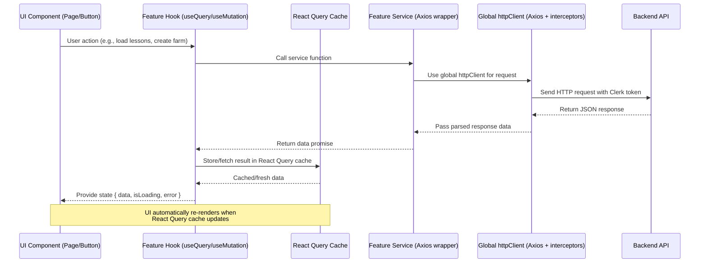

# Project Name

A brief description of what your React application does and why it exists.

---

## Tech Stack

* **React** (with hooks)
* **TypeScript**
* **Vite**
* **State Management**: (Zustand, Tanstack)
* **Styling**: (Tailwind CSS, Shadcn)
* **API Handling**: (Axios, Tanstack Query)
* Clerk: Authentication

---

## Installation & Setup

Clone the repository:

```bash
git clone https://github.com/your-username/your-repo.git
cd your-repo
```

Install dependencies:

```bash
yarn install
```

Start the development server:

```bash
yarn dev
```

Build for production:

```bash
yarn build
```

Run production build locally:

```bash
yarn run preview
```

---

## Project Structure

```bash
src/
│── app/                                # App-wide setup & configuration
│   ├── routes/
│   │   └── AppRoutes.tsx               # Centralized app routes (React Router)
│   ├── providers/                      # Global providers (wrappers)
│   │   ├── QueryProvider.tsx           # TanStack Query client setup
│   │   ├── ClerkProvider.tsx           # Clerk authentication provider
│   │   └── ZustandProvider.tsx?        # (Optional) Zustand SSR hydration
│   ├── store/                          # Global Zustand stores (non-API state)
│   │   ├── useThemeStore.ts            # e.g., light/dark mode toggle
│   │   ├── useFarmStore.ts             # Local farm simulation UI state
│   │   └── useNotificationStore.ts     # Global alerts, toasts
│   ├── hooks/                          # Global reusable hooks
│   │   └── useAuthUser.ts              # Wrapper for Clerk’s useUser
│   └── App.tsx                         # Root component: wraps providers & routes
│
│── components/                         # Shared, reusable UI across the app
│   ├── ui/                             # shadcn/ui primitives (Button, Input, etc.)
│   └── layout/                         # Layout building blocks (Navbar, Sidebar, Footer, AppShell)
│
│── features/                           # Feature-based modular architecture
│   ├── auth/                           # Authentication (Clerk integration)
│   │   ├── pages/                      # Prebuilt or custom Clerk pages
│   │   │   ├── SignInPage.tsx
│   │   │   ├── SignUpPage.tsx
│   │   │   └── UserProfilePage.tsx
│   │   ├── hooks/                      # Clerk wrapper hooks
│   │   │   ├── useAuthUser.ts          # Wrapper for Clerk’s useUser
│   │   │   └── useRequireAuth.ts       # Redirect to login if not authenticated
│   │   ├── services/                   # Optional: API calls for auth backend
│   │   │   └── authService.ts          # e.g., refresh tokens, custom roles
│   │   └── components/
│   │       └── UserButton.tsx          # Wrapper around Clerk <UserButton />
│   │
│   ├── dashboard/                      # User dashboard feature
│   │   ├── pages/
│   │   │   └── DashboardPage.tsx
│   │   ├── hooks/
│   │   │   └── useDashboard.ts
│   │   ├── services/
│   │   │   └── dashboardService.ts
│   │   └── components/
│   │       └── ProgressSummary.tsx
│   │
│   ├── virtualFarm/                    # Virtual farm simulation
│   │   ├── pages/
│   │   │   └── VirtualFarmPage.tsx
│   │   ├── hooks/
│   │   │   └── useFarmData.ts
│   │   ├── services/
│   │   │   └── farmService.ts
│   │   └── components/
│   │       ├── FarmLayout.tsx
│   │       ├── PlantSummary.tsx
│   │       └── FarmActions.tsx
│   │
│   ├── eLearning/                      # E-learning module
│   │   ├── pages/
│   │   │   └── ELearningPage.tsx
│   │   ├── hooks/
│   │   │   ├── useLessons.ts           # useQuery for fetching lessons
│   │   │   └── useCreateLesson.ts      # useMutation for adding a lesson
│   │   ├── services/
│   │   │   └── eLearningService.ts     # Axios API calls
│   │   ├── components/
│   │   │   └── LessonCard.tsx
│   │   └── types/
│   │       └── ELearningTypes.ts
│   │
│   ├── progress/                       # Progress tracking
│   │   ├── pages/
│   │   │   └── ProgressPage.tsx
│   │   ├── hooks/
│   │   │   └── useProgress.ts
│   │   ├── services/
│   │   │   └── progressService.ts
│   │   └── components/
│   │       └── ProgressTracker.tsx
│   │
│   ├── forum/                          # Community forum
│   │   ├── pages/
│   │   │   └── ForumPage.tsx
│   │   ├── hooks/
│   │   │   └── useForumPosts.ts
│   │   ├── services/
│   │   │   └── forumService.ts
│   │   └── components/
│   │       ├── ForumPost.tsx
│   │       └── PostForm.tsx
│   │
│   └── account/                        # User profile & account settings
│       ├── pages/
│       │   └── AccountPage.tsx
│       ├── hooks/
│       │   └── useAccount.ts
│       ├── services/
│       │   └── accountService.ts
│       └── components/
│           └── ProfileForm.tsx
│
│── services/                           # App-wide shared services
│   ├── httpClient.ts                   # Axios instance + interceptors (Clerk token injection)
│   └── apiConfig.ts                    # API base URLs, configs
│
│── utils/                              # Shared utility functions
│   ├── formatDate.ts
│   ├── validators.ts
│   └── constants.ts
│
│── types/                              # Global TypeScript types/interfaces
│   └── global.d.ts
│
│── config/                             # Environment configs & constants
│   └── env.ts
│
│── index.tsx                           # React entry point (renders <App />)
└── main.tsx                            # App bootstrap (React 18 root, StrictMode, etc.)
```

## Data flow Architecture



---

## Scripts

* `dev` – Start development server
* `build` – Build production-ready app
* `preview` – Preview production build
* `test` – Run tests

---

## Deployment

1. Build the app with:

   ```bash
   yarn run build
   ```

2. Deploy the `dist/` folder to your hosting provider (Netlify, Vercel, AWS, etc.).

---

## Environment Variables

Create a `.env` file in the root of your project:

```env
VITE_API_URL=https://api.example.com
VITE_API_KEY=yourapikey
```

---

## Contributing

1. Fork the project
2. Create a feature branch (`git checkout -b feature/awesome-feature`)
3. Commit your changes (`git commit -m "Add awesome feature"`)
4. Push to your branch (`git push origin feature/awesome-feature`)
5. Open a Pull Request
6.
# Farmlingo
Farmlingo
